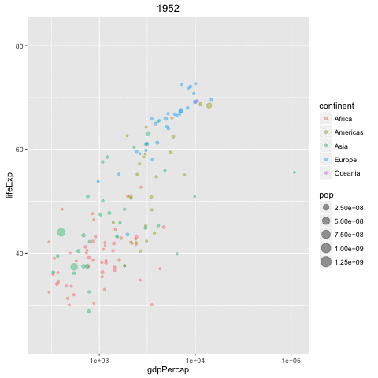

Inspired by Hans Rosling's TED Talk:
[The best stats you've ever seen](https://www.ted.com/talks/hans_rosling_shows_the_best_stats_you_ve_ever_seen).

The code is taken nearly verbatim from the [gganimate example](https://github.com/dgrtwo/gganimate#gganimate-create-easy-animations-with-ggplot2).

# Install packages

```{r install-packages, eval=FALSE}
install.packages(c("devtools", "dplyr", "ggplot2", "readr"))
library(devtools)
devtools::install_github("dgrtwo/gganimate")
```

Note that [gganimate](https://github.com/dgrtwo/gganimate) requires [ImageMagick](http://www.imagemagick.org/script/index.php). To install it, use [Homebrew](http://brew.sh) on a Mac and [Linuxbrew](http://linuxbrew.sh) or `apt-get` or `yum` on Linux:

```sh
brew install imagemagick
sudo apt-get install imagemagick
sudo yum install imagemagick
```

# Load packages

```{r setup, message=FALSE}
library(dplyr)
library(gganimate)
library(ggplot2)
library(readr)
```

# Read the Gapminder data

```{r read-gapminder-data}
gapminder <- read_tsv("gapminderDataFiveYear.tsv")
glimpse(gapminder)
```

# Plot the Gapminder data

```{r plot-gapminder-data}
gapminder_plot <- ggplot(gapminder) +
	aes(x = gdpPercap, y = lifeExp, colour = continent, size = pop,
		frame = year) +
	geom_point(alpha = 0.4) +
	scale_x_log10()
gapminder_plot
```

# Animate the Gapminder data

```{r animate-gapminder-data, message=FALSE}
gganimate(gapminder_plot, filename = "gapminder-gganimate.gif")
```


