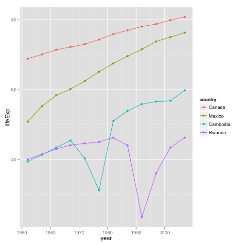
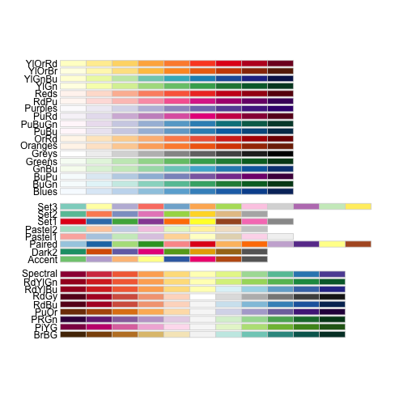
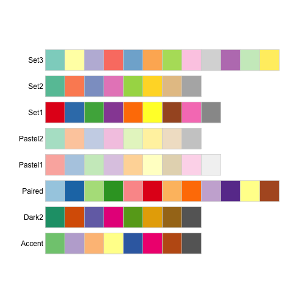
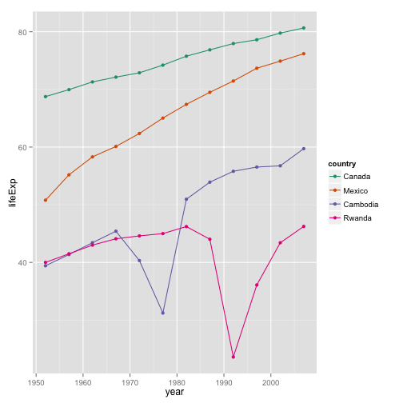
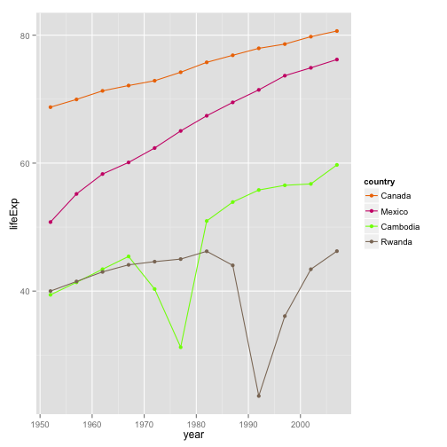

Note: this HTML is made by applying `knitr::spin()` to an R script. So the
narrative is very minimal.


```r
library(ggplot2)
library(RColorBrewer)
```

pick a way to load the data


```r
gdURL <- "http://tiny.cc/gapminder"
gDat <- read.delim(file = gdURL) 
gDat <- read.delim("gapminderDataFiveYear.tsv")
str(gDat)
```

```
## 'data.frame':	1704 obs. of  6 variables:
##  $ country  : Factor w/ 142 levels "Afghanistan",..: 1 1 1 1 1 1 1 1 1 1 ...
##  $ year     : int  1952 1957 1962 1967 1972 1977 1982 1987 1992 1997 ...
##  $ pop      : num  8425333 9240934 10267083 11537966 13079460 ...
##  $ continent: Factor w/ 5 levels "Africa","Americas",..: 3 3 3 3 3 3 3 3 3 3 ...
##  $ lifeExp  : num  28.8 30.3 32 34 36.1 ...
##  $ gdpPercap: num  779 821 853 836 740 ...
```

let just look at four countries


```r
jCountries <- c("Canada", "Rwanda", "Cambodia", "Mexico")
x <- droplevels(subset(gDat, country %in% jCountries))
ggplot(x, aes(x = year, y = lifeExp, color = country)) +
  geom_line() + geom_point()
```

 

reorder the country factor to reflect lifeExp in 2007


```r
x <- transform(x, country = reorder(country, -1 * lifeExp, max))
ggplot(x, aes(x = year, y = lifeExp, color = country)) +
  geom_line() + geom_point()
```

 

look at the RColorBrewer color palettes


```r
display.brewer.all()
```

 

focus on the qualitative palettes


```r
display.brewer.all(type = "qual")
```

 

pick some colors


```r
jColors = brewer.pal(n = 8, "Dark2")[seq_len(nlevels(x$country))]
names(jColors) <- levels(x$country)
```

remake the plot with our new colors


```r
ggplot(x, aes(x = year, y = lifeExp, color = country)) +
  geom_line() + geom_point() +
  scale_color_manual(values = jColors)
```

 

pick some super ugly colors for shock value


```r
kColors = c("darkorange2", "deeppink3", "lawngreen", "peachpuff4")
names(kColors) <- levels(x$country)
```

remake the plot with our ugly colors


```r
ggplot(x, aes(x = year, y = lifeExp, color = country)) +
  geom_line() + geom_point() +
  scale_color_manual(values = kColors)
```

 

```r
sessionInfo()
```

```
## R version 3.1.0 (2014-04-10)
## Platform: x86_64-apple-darwin10.8.0 (64-bit)
## 
## locale:
## [1] en_CA.UTF-8/en_CA.UTF-8/en_CA.UTF-8/C/en_CA.UTF-8/en_CA.UTF-8
## 
## attached base packages:
## [1] stats     graphics  grDevices utils     datasets  methods   base     
## 
## other attached packages:
## [1] RColorBrewer_1.0-5 ggplot2_0.9.3.1    knitr_1.5.33      
## 
## loaded via a namespace (and not attached):
##  [1] colorspace_1.2-4 digest_0.6.4     evaluate_0.5.5   formatR_0.10    
##  [5] grid_3.1.0       gtable_0.1.2     labeling_0.2     MASS_7.3-33     
##  [9] munsell_0.4.2    plyr_1.8.1       proto_0.3-10     Rcpp_0.11.1     
## [13] reshape2_1.4     scales_0.2.4     stringr_0.6.2    tools_3.1.0
```

