Note: this HTML is made by applying `knitr::spin()` to an R script. So the
narrative is very minimal.


```r
library(ggplot2)
```

pick a way to load the data


```r
gdURL <- "http://tiny.cc/gapminder"
gDat <- read.delim(file = gdURL) 
gDat <- read.delim("gapminderDataFiveYear.tsv")
str(gDat)
```

```
## 'data.frame':	1704 obs. of  6 variables:
##  $ country  : Factor w/ 142 levels "Afghanistan",..: 1 1 1 1 1 1 1 1 1 1 ...
##  $ year     : int  1952 1957 1962 1967 1972 1977 1982 1987 1992 1997 ...
##  $ pop      : num  8425333 9240934 10267083 11537966 13079460 ...
##  $ continent: Factor w/ 5 levels "Africa","Americas",..: 3 3 3 3 3 3 3 3 3 3 ...
##  $ lifeExp  : num  28.8 30.3 32 34 36.1 ...
##  $ gdpPercap: num  779 821 853 836 740 ...
```

```r
ggplot(gDat, aes(x = gdpPercap, y = lifeExp)) # nothing to plot yet!
```

```
## Error: No layers in plot
```

```r
p <- ggplot(gDat, aes(x = gdpPercap, y = lifeExp)) # just initializes
```

scatterplot


```r
p + geom_point()
```

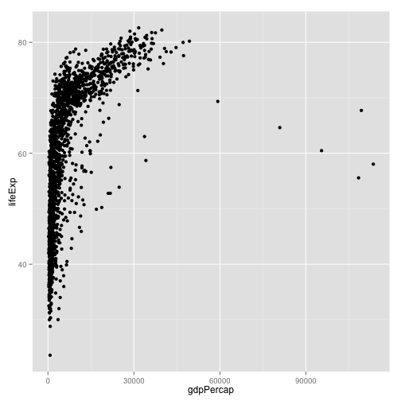 

```r
#p + layer(geom = "point")
```

log transformation ... quick and dirty


```r
ggplot(gDat, aes(x = log10(gdpPercap), y = lifeExp)) + geom_point()
```

 

a better way to log transform


```r
p + geom_point() + scale_x_log10()
```

 

let's make that stick


```r
p <- p + scale_x_log10()
```

common workflow: gradually build up the plot you want  
re-define the object 'p' as you develop "keeper" commands  
convey continent by color: MAP continent variable to aesthetic color


```r
p + geom_point(aes(color = continent))
```

 

```r
ggplot(gDat, aes(x = gdpPercap, y = lifeExp, color = continent)) +
  geom_point() + scale_x_log10() # in full detail, up to now
```

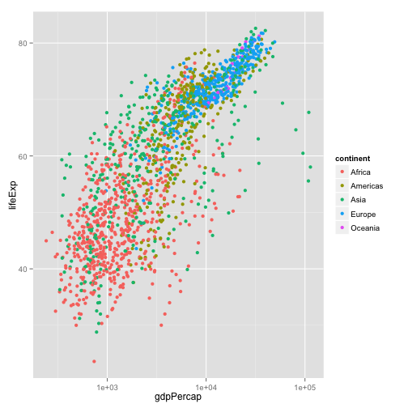 

address overplotting: SET alpha transparency and size to a value


```r
p + geom_point(alpha = (1/3), size = 3)
```

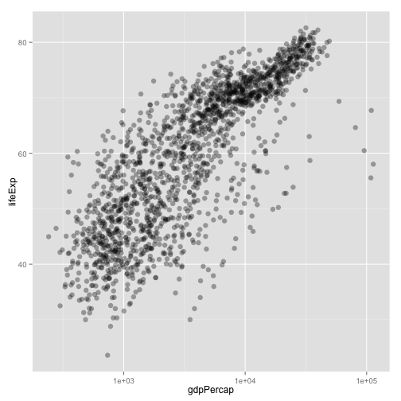 

add a fitted curve or line


```r
p + geom_point() + geom_smooth()
```

```
## geom_smooth: method="auto" and size of largest group is >=1000, so using gam with formula: y ~ s(x, bs = "cs"). Use 'method = x' to change the smoothing method.
```

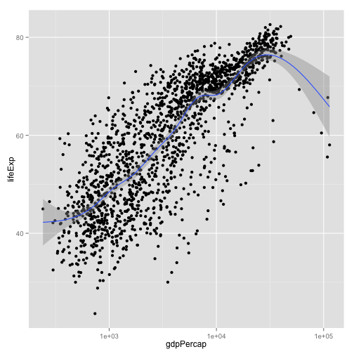 

```r
p + geom_point() + geom_smooth(lwd = 3, se = FALSE)
```

```
## geom_smooth: method="auto" and size of largest group is >=1000, so using gam with formula: y ~ s(x, bs = "cs"). Use 'method = x' to change the smoothing method.
```

 

```r
p + geom_point() + geom_smooth(lwd = 3, se = FALSE, method = "lm")
```

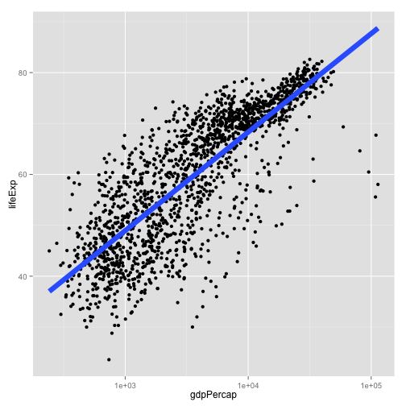 

revive our interest in continents!


```r
p + aes(color = continent) + geom_point() + geom_smooth(lwd = 3, se = FALSE)
```

```
## geom_smooth: method="auto" and size of largest group is <1000, so using loess. Use 'method = x' to change the smoothing method.
```

 

facetting: another way to exploit a factor


```r
p + geom_point(alpha = (1/3), size = 3) + facet_wrap(~ continent)
```

 

```r
p + geom_point(alpha = (1/3), size = 3) + facet_wrap(~ continent) +
  geom_smooth(lwd = 2, se = FALSE)
```

```
## geom_smooth: method="auto" and size of largest group is <1000, so using loess. Use 'method = x' to change the smoothing method.
## geom_smooth: method="auto" and size of largest group is <1000, so using loess. Use 'method = x' to change the smoothing method.
## geom_smooth: method="auto" and size of largest group is <1000, so using loess. Use 'method = x' to change the smoothing method.
## geom_smooth: method="auto" and size of largest group is <1000, so using loess. Use 'method = x' to change the smoothing method.
## geom_smooth: method="auto" and size of largest group is <1000, so using loess. Use 'method = x' to change the smoothing method.
```

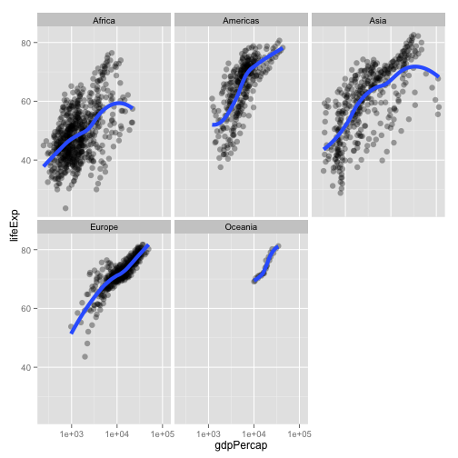 

exercises:  
* plot lifeExp against year  
* make mini-plots, split out by continent  
* add a fitted smooth and/or linear regression, w/ or w/o facetting  
* other ideas?  
plot lifeExp against year


```r
(y <- ggplot(gDat, aes(x = year, y = lifeExp)) + geom_point())
```

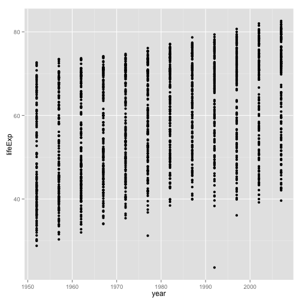 

make mini-plots, split out by continent


```r
y + facet_wrap(~ continent)
```

 

add a fitted smooth and/or linear regression, w/ or w/o facetting


```r
y + geom_smooth(se = FALSE, lwd = 2) +
  geom_smooth(se = FALSE, method ="lm", color = "orange", lwd = 2)
```

```
## geom_smooth: method="auto" and size of largest group is >=1000, so using gam with formula: y ~ s(x, bs = "cs"). Use 'method = x' to change the smoothing method.
```

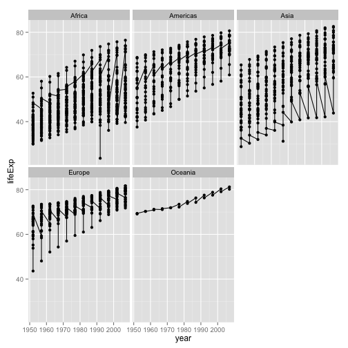 

```r
y + geom_smooth(se = FALSE, lwd = 2) +
  facet_wrap(~ continent)
```

```
## geom_smooth: method="auto" and size of largest group is <1000, so using loess. Use 'method = x' to change the smoothing method.
## geom_smooth: method="auto" and size of largest group is <1000, so using loess. Use 'method = x' to change the smoothing method.
## geom_smooth: method="auto" and size of largest group is <1000, so using loess. Use 'method = x' to change the smoothing method.
## geom_smooth: method="auto" and size of largest group is <1000, so using loess. Use 'method = x' to change the smoothing method.
## geom_smooth: method="auto" and size of largest group is <1000, so using loess. Use 'method = x' to change the smoothing method.
```

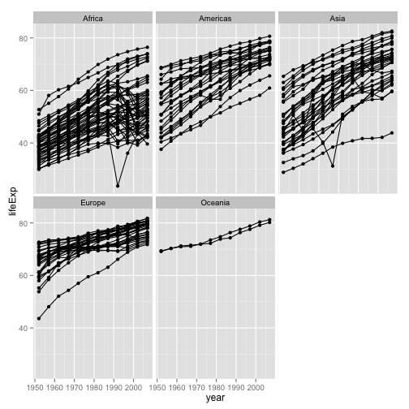 

last bit on scatterplots  
how can we "connect the dots" for one country?  
i.e. make a spaghetti plot?


```r
y + facet_wrap(~ continent) + geom_line() # uh, no
```

 

```r
y + facet_wrap(~ continent) + geom_line(aes(group = country)) # yes!
```

 

```r
y + facet_wrap(~ continent) + geom_line(aes(group = country)) +
  geom_smooth(se = FALSE, lwd = 2) 
```

```
## geom_smooth: method="auto" and size of largest group is <1000, so using loess. Use 'method = x' to change the smoothing method.
## geom_smooth: method="auto" and size of largest group is <1000, so using loess. Use 'method = x' to change the smoothing method.
## geom_smooth: method="auto" and size of largest group is <1000, so using loess. Use 'method = x' to change the smoothing method.
## geom_smooth: method="auto" and size of largest group is <1000, so using loess. Use 'method = x' to change the smoothing method.
## geom_smooth: method="auto" and size of largest group is <1000, so using loess. Use 'method = x' to change the smoothing method.
```

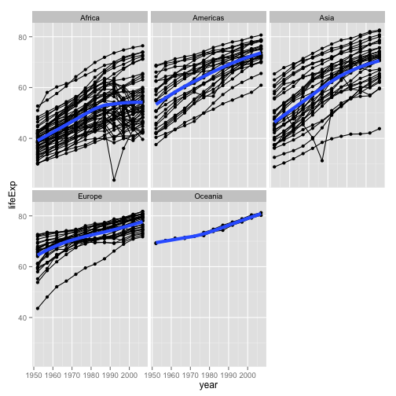 

note about subsetting data
sadly, ggplot() does not have a 'subset =' argument  
so do that 'on the fly' with subset(..., subset = ...)


```r
ggplot(subset(gDat, country == "Zimbabwe"),
       aes(x = year, y = lifeExp)) + geom_line() + geom_point()
```

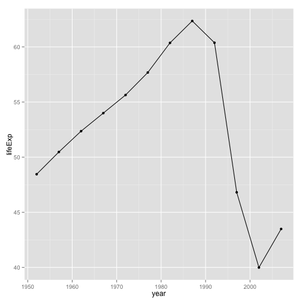 

```r
sessionInfo()
```

```
## R version 3.1.0 (2014-04-10)
## Platform: x86_64-apple-darwin10.8.0 (64-bit)
## 
## locale:
## [1] en_CA.UTF-8/en_CA.UTF-8/en_CA.UTF-8/C/en_CA.UTF-8/en_CA.UTF-8
## 
## attached base packages:
## [1] stats     graphics  grDevices utils     datasets  methods   base     
## 
## other attached packages:
## [1] mgcv_1.7-29     nlme_3.1-117    ggplot2_0.9.3.1 knitr_1.5.33   
## 
## loaded via a namespace (and not attached):
##  [1] colorspace_1.2-4 digest_0.6.4     evaluate_0.5.5   formatR_0.10    
##  [5] grid_3.1.0       gtable_0.1.2     labeling_0.2     lattice_0.20-29 
##  [9] markdown_0.6.5   MASS_7.3-33      Matrix_1.1-3     munsell_0.4.2   
## [13] plyr_1.8.1       proto_0.3-10     Rcpp_0.11.1      reshape2_1.4    
## [17] rmarkdown_0.1.94 scales_0.2.4     stringr_0.6.2    tools_3.1.0
```

