gapminder-ggplot2-scatterplot.r
================
Jenny Bryan
Mon Oct 3 23:50:31 2016

Note: this report is made by rendering an R script. So the narrative is very minimal.

``` r
library(tibble)
library(ggplot2)
```

Load the [`gapminder`](https://github.com/jennybc/gapminder) data package.

``` r
library(gapminder)
gapminder
```

    ## # A tibble: 1,704 × 6
    ##        country continent  year lifeExp      pop gdpPercap
    ##         <fctr>    <fctr> <int>   <dbl>    <int>     <dbl>
    ## 1  Afghanistan      Asia  1952  28.801  8425333  779.4453
    ## 2  Afghanistan      Asia  1957  30.332  9240934  820.8530
    ## 3  Afghanistan      Asia  1962  31.997 10267083  853.1007
    ## 4  Afghanistan      Asia  1967  34.020 11537966  836.1971
    ## 5  Afghanistan      Asia  1972  36.088 13079460  739.9811
    ## 6  Afghanistan      Asia  1977  38.438 14880372  786.1134
    ## 7  Afghanistan      Asia  1982  39.854 12881816  978.0114
    ## 8  Afghanistan      Asia  1987  40.822 13867957  852.3959
    ## 9  Afghanistan      Asia  1992  41.674 16317921  649.3414
    ## 10 Afghanistan      Asia  1997  41.763 22227415  635.3414
    ## # ... with 1,694 more rows

``` r
ggplot(gapminder, aes(x = gdpPercap, y = lifeExp)) # nothing to plot yet!
```

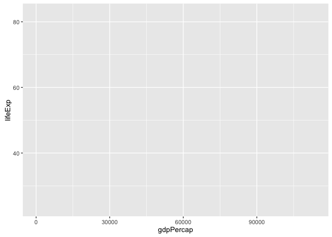

``` r
ggplot(gapminder, aes(x = gdpPercap, y = lifeExp)) +
  geom_point()
```

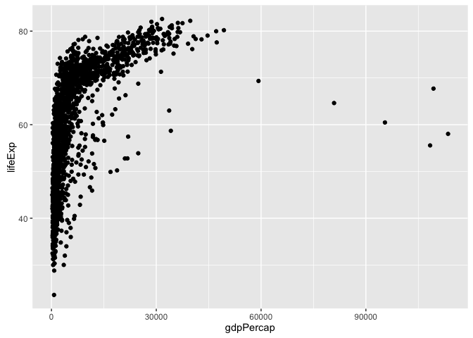

``` r
p <- ggplot(gapminder, aes(x = gdpPercap, y = lifeExp)) # just initializes
```

scatterplot

``` r
p + geom_point()
```

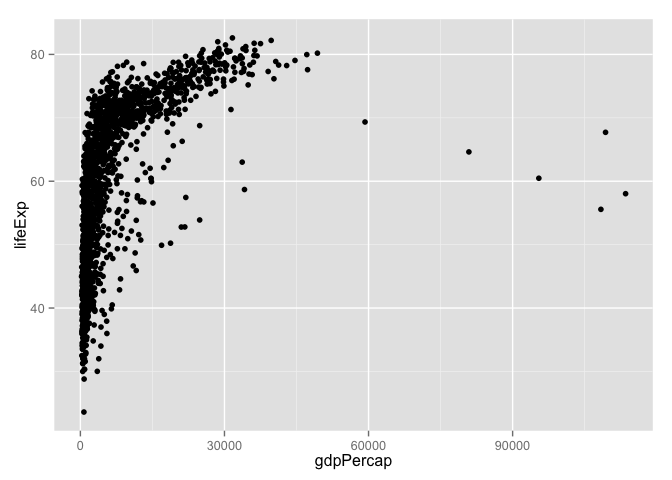

log transformation ... quick and dirty

``` r
ggplot(gapminder, aes(x = log10(gdpPercap), y = lifeExp)) +
  geom_point()
```

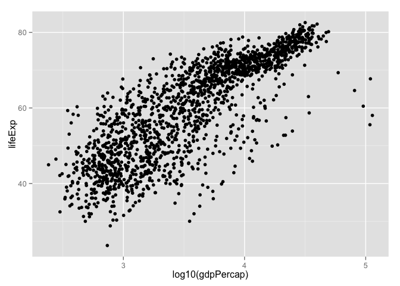

a better way to log transform

``` r
p + geom_point() + scale_x_log10()
```


let's make that stick

``` r
p <- p + scale_x_log10()
```

common workflow: gradually build up the plot you want
re-define the object 'p' as you develop "keeper" commands
convey continent by color: MAP continent variable to aesthetic color

``` r
p + geom_point(aes(color = continent))
```

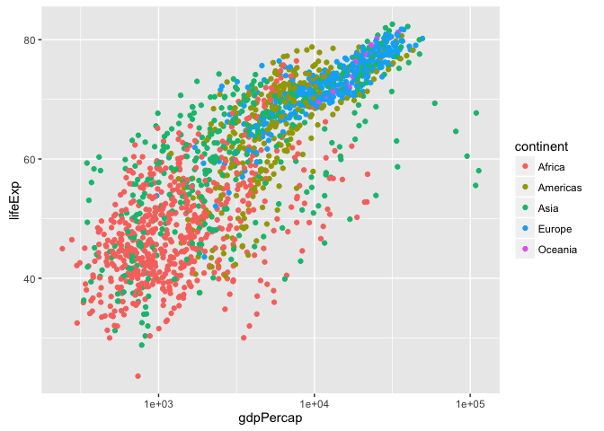

``` r
## add summary(p)!
plot(gapminder, aes(x = gdpPercap, y = lifeExp, color = continent)) +
  geom_point() + scale_x_log10() # in full detail, up to now
```

    ## Error in plot(gapminder, aes(x = gdpPercap, y = lifeExp, color = continent)) + : non-numeric argument to binary operator

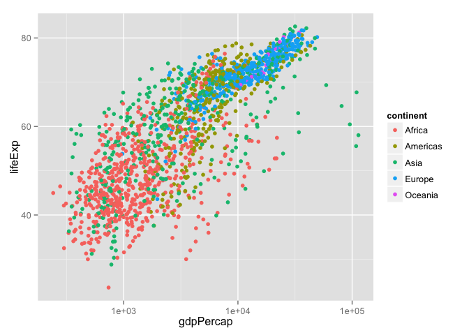

address overplotting: SET alpha transparency and size to a value

``` r
p + geom_point(alpha = (1/3), size = 3)
```


add a fitted curve or line

``` r
p + geom_point() + geom_smooth()
```

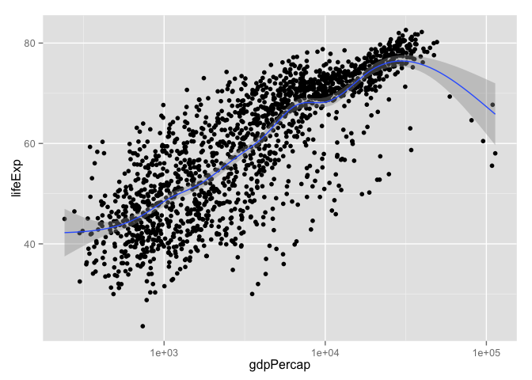

``` r
p + geom_point() + geom_smooth(lwd = 3, se = FALSE)
```

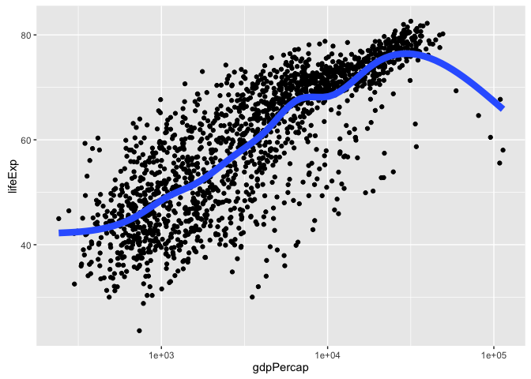

``` r
p + geom_point() + geom_smooth(lwd = 3, se = FALSE, method = "lm")
```

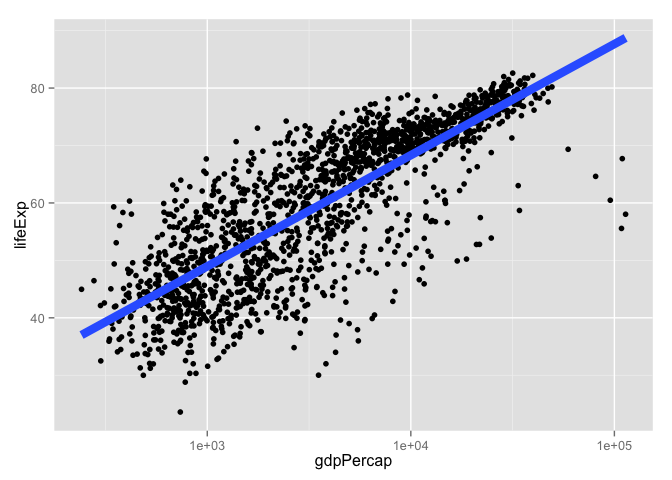

revive our interest in continents!

``` r
p + aes(color = continent) + geom_point() +
  geom_smooth(lwd = 3, se = FALSE)
```

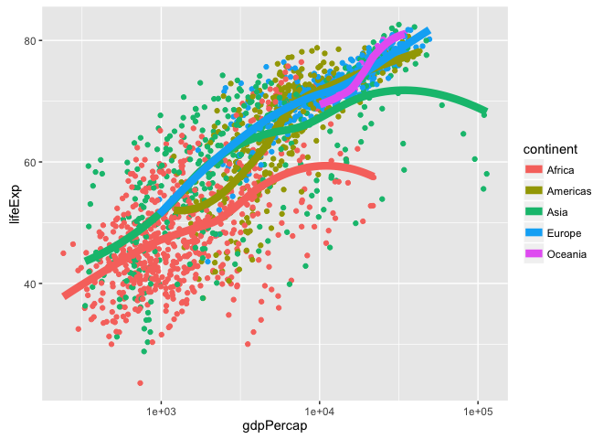

facetting: another way to exploit a factor

``` r
p + geom_point(alpha = (1/3), size = 3) +
  facet_wrap(~ continent)
```

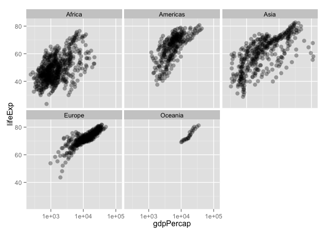

``` r
p + geom_point(alpha = (1/3), size = 3) +
  facet_wrap(~ continent) +
  geom_smooth(lwd = 2, se = FALSE)
```

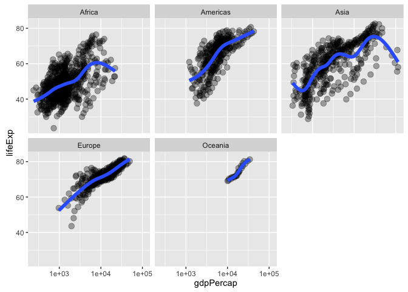

exercises:
\* plot lifeExp against year

``` r
ggplot(gapminder, aes(x = year, y = lifeExp,
                      color = continent)) +
  geom_jitter(alpha = 1/3, size = 3)
```

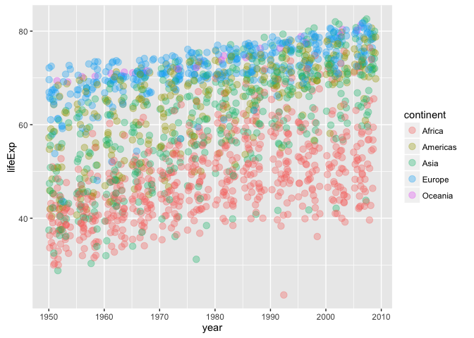

-   make mini-plots, split out by continent HINT: use facet\_wrap()

``` r
ggplot(gapminder, aes(x = year, y = lifeExp,
                      color = continent)) +
  facet_wrap(~ continent, scales = "free_x") +
  geom_jitter(alpha = 1/3, size = 3) +
  scale_color_manual(values = continent_colors)
```

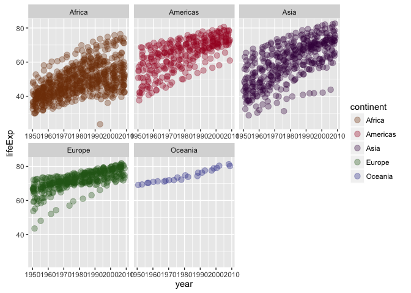

``` r
ggplot(subset(gapminder, continent != "Oceania"),
       aes(x = year, y = lifeExp, group = country, color = country)) +
  geom_line(lwd = 1, show_guide = FALSE) + facet_wrap(~ continent) +
  scale_color_manual(values = country_colors) +
  #scale_color_brewer()+
  theme_bw() + theme(strip.text = element_text(size = rel(1.1)))
```

    ## Warning: `show_guide` has been deprecated. Please use `show.legend`
    ## instead.

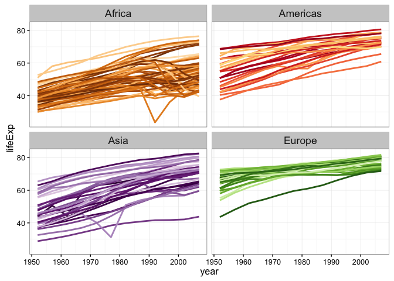

-   add a fitted smooth and/or linear regression, w/ or w/o facetting

``` r
ggplot(gapminder, aes(x = year, y = lifeExp,
                      color = continent)) +
  facet_wrap(~ continent, scales = "free_x") +
  geom_jitter(alpha = 1/3, size = 3) +
  scale_color_manual(values = continent_colors) +
  geom_smooth(lwd = 2)
```

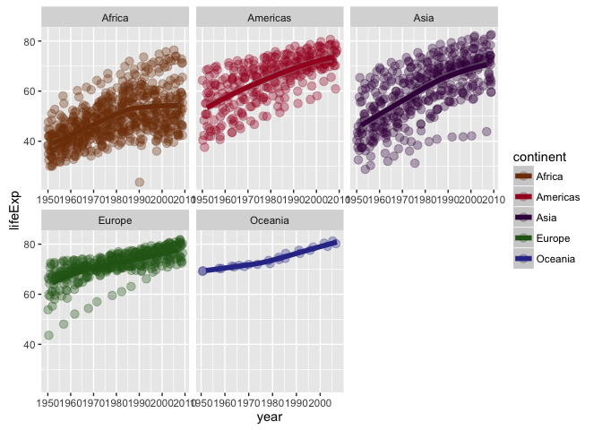

-   use `dplyr::filter()` to plot lifeExp against year for just one country or continent

``` r
jc <- "Cambodia"
gapminder %>% 
  filter(country == jc) %>% 
  ggplot(aes(x = year, y = lifeExp)) +
  labs(title = jc) +
  geom_line()
```

    ## Error in eval(expr, envir, enclos): could not find function "%>%"

``` r
rwanda <- gapminder %>%
  filter(country == "Rwanda")
```

    ## Error in eval(expr, envir, enclos): could not find function "%>%"

``` r
p <- ggplot(rwanda, aes(x = year, y = lifeExp)) +
  labs(title = "Rwanda") +
  geom_line()
```

    ## Error in ggplot(rwanda, aes(x = year, y = lifeExp)): object 'rwanda' not found

``` r
print(p)
```

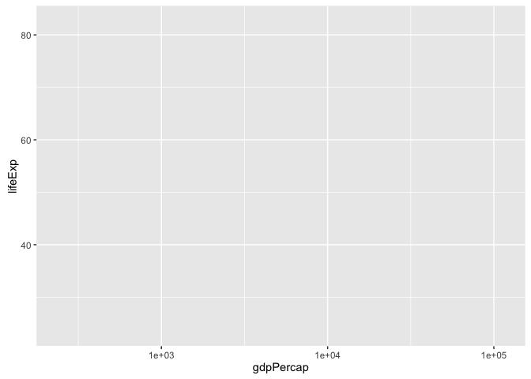

``` r
ggsave("rwanda.pdf")
```

    ## Saving 7 x 5 in image

``` r
ggsave("rwanda.pdf",plot = p)
```

    ## Saving 7 x 5 in image

-   other ideas?
    plot lifeExp against year

``` r
(y <- ggplot(gapminder, aes(x = year, y = lifeExp)) + geom_point())
```

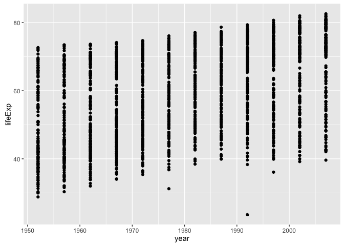

make mini-plots, split out by continent

``` r
y + facet_wrap(~ continent)
```

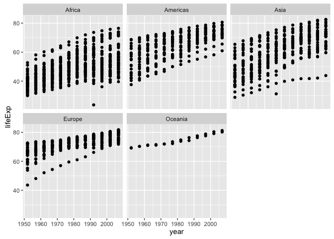

add a fitted smooth and/or linear regression, w/ or w/o facetting

``` r
y + geom_smooth(se = FALSE, lwd = 2) +
  geom_smooth(se = FALSE, method ="lm", color = "orange", lwd = 2)
```

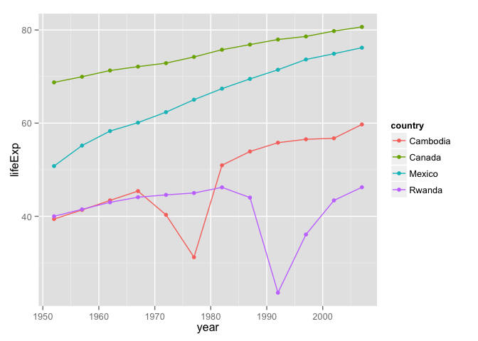

``` r
y + geom_smooth(se = FALSE, lwd = 2) +
  facet_wrap(~ continent)
```


last bit on scatterplots
how can we "connect the dots" for one country?
i.e. make a spaghetti plot?

``` r
y + facet_wrap(~ continent) + geom_line() # uh, no
```

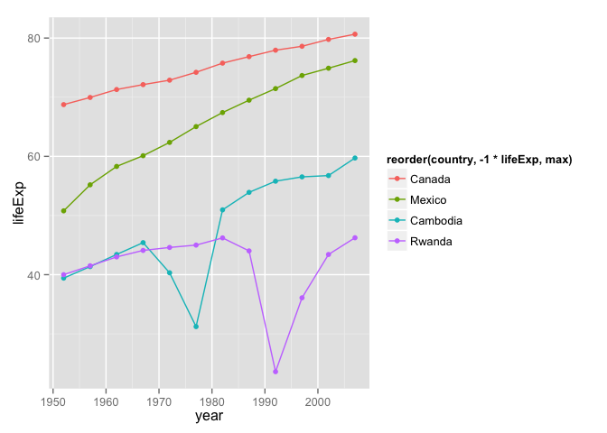

``` r
y + facet_wrap(~ continent) + geom_line(aes(group = country)) # yes!
```

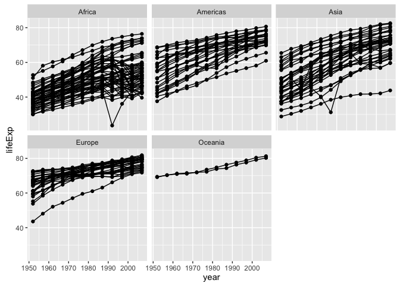

``` r
y + facet_wrap(~ continent) + geom_line(aes(group = country)) +
  geom_smooth(se = FALSE, lwd = 2) 
```

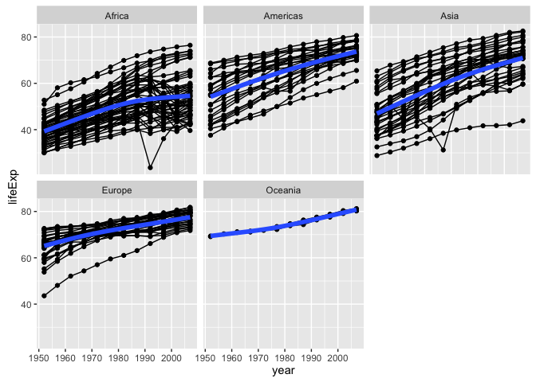

note about subsetting data sadly, ggplot() does not have a 'subset =' argument
so do that 'on the fly' with subset(..., subset = ...)

``` r
ggplot(subset(gapminder, country == "Zimbabwe"),
       aes(x = year, y = lifeExp)) + geom_line() + geom_point()
```

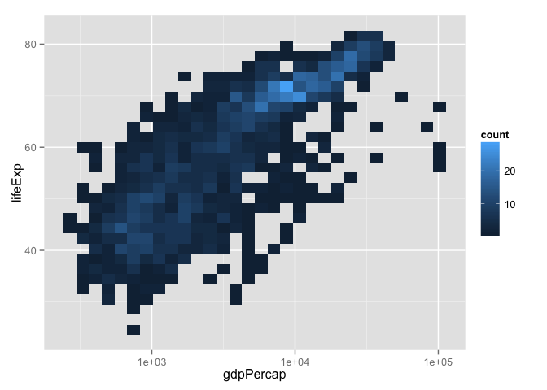

or could do with dplyr::filter

``` r
suppressPackageStartupMessages(library(dplyr))
ggplot(gapminder %>% filter(country == "Zimbabwe"),
       aes(x = year, y = lifeExp)) + geom_line() + geom_point()
```

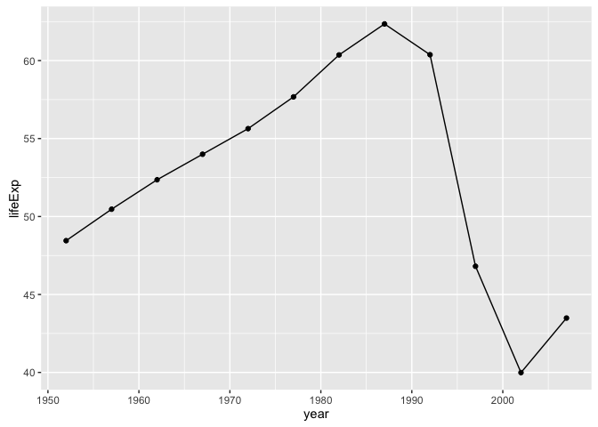

let just look at four countries

``` r
jCountries <- c("Canada", "Rwanda", "Cambodia", "Mexico")
ggplot(subset(gapminder, country %in% jCountries),
       aes(x = year, y = lifeExp, color = country)) + geom_line() + geom_point()
```


when you really care, make your legend easy to navigate
this means visual order = data order = factor level order

``` r
ggplot(subset(gapminder, country %in% jCountries),
       aes(x = year, y = lifeExp, color = reorder(country, -1 * lifeExp, max))) +
  geom_line() + geom_point()
```

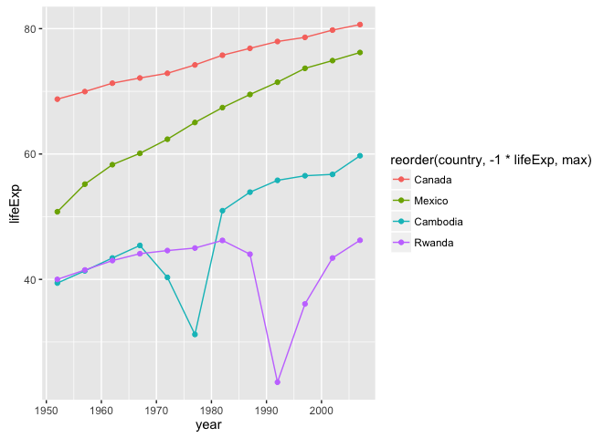

another approach to overplotting ggplot(gapminder, aes(x = gdpPercap, y = lifeExp)) +

``` r
ggplot(gapminder, aes(x = gdpPercap, y = lifeExp)) +
  scale_x_log10() + geom_bin2d()
```

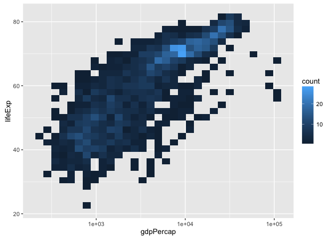

``` r
sessionInfo()
```

    ## R version 3.3.1 (2016-06-21)
    ## Platform: x86_64-apple-darwin13.4.0 (64-bit)
    ## Running under: OS X 10.11.6 (El Capitan)
    ## 
    ## locale:
    ## [1] en_CA.UTF-8/en_CA.UTF-8/en_CA.UTF-8/C/en_CA.UTF-8/en_CA.UTF-8
    ## 
    ## attached base packages:
    ## [1] stats     graphics  grDevices utils     datasets  methods   base     
    ## 
    ## other attached packages:
    ## [1] dplyr_0.5.0     gapminder_0.2.0 ggplot2_2.1.0   tibble_1.2     
    ## [5] knitr_1.14.2   
    ## 
    ## loaded via a namespace (and not attached):
    ##  [1] Rcpp_0.12.7        magrittr_1.5       munsell_0.4.3     
    ##  [4] colorspace_1.2-6   lattice_0.20-33    R6_2.1.3          
    ##  [7] stringr_1.1.0      plyr_1.8.4         tools_3.3.1       
    ## [10] grid_3.3.1         gtable_0.2.0       nlme_3.1-128      
    ## [13] mgcv_1.8-13        DBI_0.4-1          htmltools_0.3.5   
    ## [16] lazyeval_0.2.0     yaml_2.1.13        assertthat_0.1    
    ## [19] digest_0.6.10      Matrix_1.2-6       formatR_1.4       
    ## [22] evaluate_0.9       rmarkdown_1.0.9014 labeling_0.3      
    ## [25] stringi_1.1.1      scales_0.4.0
