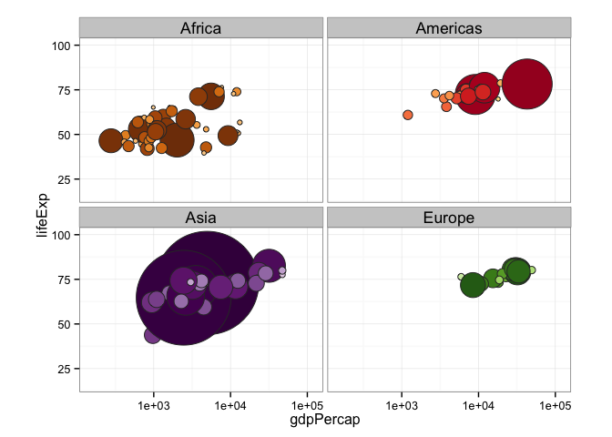

Jenny Bryan  


Note: this HTML is made by applying `knitr::spin()` to an R script. So the
narrative is very minimal.


```r
library(ggplot2)
```

pick a way to load the data


```r
#gdURL <- "http://tiny.cc/gapminder"
#gapminder <- read.delim(file = gdURL) 
#gapminder <- read.delim("gapminderDataFiveYear.tsv")
library(gapminder)
str(gapminder)
```

```
## 'data.frame':	1704 obs. of  6 variables:
##  $ country  : Factor w/ 142 levels "Afghanistan",..: 1 1 1 1 1 1 1 1 1 1 ...
##  $ continent: Factor w/ 5 levels "Africa","Americas",..: 3 3 3 3 3 3 3 3 3 3 ...
##  $ year     : num  1952 1957 1962 1967 1972 ...
##  $ lifeExp  : num  28.8 30.3 32 34 36.1 ...
##  $ pop      : num  8425333 9240934 10267083 11537966 13079460 ...
##  $ gdpPercap: num  779 821 853 836 740 ...
```

drop Oceania


```r
gapminder <- droplevels(subset(gapminder, continent != "Oceania"))
```

Note that the gapminder package ships with color schemes for countries and continents.


```r
head(country_colors)
```

```
##          Nigeria            Egypt         Ethiopia Congo, Dem. Rep. 
##        "#7F3B08"        "#833D07"        "#873F07"        "#8B4107" 
##     South Africa            Sudan 
##        "#8F4407"        "#934607"
```

```r
jYear <- 2007 # this can obviously be changed
jPch <- 21
jDarkGray <- 'grey20'
jXlim <- c(150, 115000)
jYlim <- c(16, 100)

ggplot(subset(gapminder, year == jYear),
       aes(x = gdpPercap, y = lifeExp)) +
  scale_x_log10(limits = jXlim) + ylim(jYlim) +
  geom_point(aes(size = sqrt(pop/pi)), pch = jPch, color = jDarkGray,
             show_guide = FALSE) + 
  scale_size_continuous(range=c(1,40)) +
  facet_wrap(~ continent) + coord_fixed(ratio = 1/43) +
  aes(fill = country) + scale_fill_manual(values = country_colors) +
  theme_bw() + theme(strip.text = element_text(size = rel(1.1)))
```

 

```r
ggplot(gapminder, aes(x = year, y = lifeExp, group = country)) +
  geom_line(lwd = 1, show_guide = FALSE) + facet_wrap(~ continent) +
  aes(color = country) + scale_color_manual(values = country_colors) +
  theme_bw() + theme(strip.text = element_text(size = rel(1.1)))
```

 


---
title: "gapminder-ggplot2-shock-and-awe.r"
author: "jenny"
date: "Thu May 14 13:06:07 2015"
---
