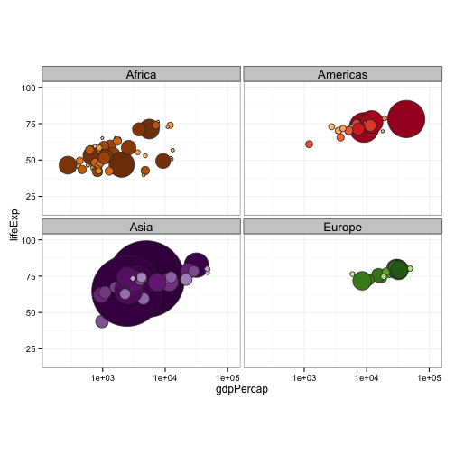
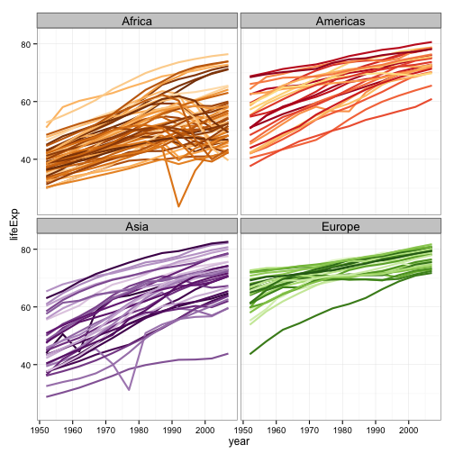

Note: this HTML is made by applying `knitr::spin()` to an R script. So the
narrative is very minimal.


```r
library(ggplot2)
```

pick a way to load the data


```r
gdURL <- "http://tiny.cc/gapminder"
gDat <- read.delim(file = gdURL) 
gDat <- read.delim("gapminderDataFiveYear.tsv")
str(gDat)
```

```
## 'data.frame':	1704 obs. of  6 variables:
##  $ country  : Factor w/ 142 levels "Afghanistan",..: 1 1 1 1 1 1 1 1 1 1 ...
##  $ year     : int  1952 1957 1962 1967 1972 1977 1982 1987 1992 1997 ...
##  $ pop      : num  8425333 9240934 10267083 11537966 13079460 ...
##  $ continent: Factor w/ 5 levels "Africa","Americas",..: 3 3 3 3 3 3 3 3 3 3 ...
##  $ lifeExp  : num  28.8 30.3 32 34 36.1 ...
##  $ gdpPercap: num  779 821 853 836 740 ...
```

load the color scheme


```r
country_colors <- read.delim("gapminder-country-colors.tsv",
                             colClasses = list(color = "character"))
str(country_colors)
```

```
## 'data.frame':	142 obs. of  3 variables:
##  $ continent: Factor w/ 5 levels "Africa","Americas",..: 1 1 1 1 1 1 1 1 1 1 ...
##  $ country  : Factor w/ 142 levels "Afghanistan",..: 95 39 43 118 28 86 3 121 127 69 ...
##  $ color    : chr  "#7F3B08" "#833D07" "#873F07" "#8B4107" ...
```

drop Oceania


```r
gDat <- droplevels(subset(gDat, continent != "Oceania"))
country_colors <- droplevels(subset(country_colors, continent != "Oceania"))

jYear <- 2007 # this can obviously be changed
jPch <- 21
jDarkGray <- 'grey20'
jXlim <- c(150, 115000)
jYlim <- c(16, 100)

## handy for ggplot2 scale_fill_manual()
jColors <- country_colors$color
names(jColors) <- country_colors$country

ggplot(subset(gDat, year == jYear),
       aes(x = gdpPercap, y = lifeExp)) +
  scale_x_log10(limits = jXlim) + ylim(jYlim) +
  geom_point(aes(size = sqrt(pop/pi)), pch = jPch, color = jDarkGray,
             show_guide = FALSE) + 
  scale_size_continuous(range=c(1,40)) +
  facet_wrap(~ continent) + coord_fixed(ratio = 1/43) +
  aes(fill = country) + scale_fill_manual(values = jColors) +
  theme_bw() + theme(strip.text = element_text(size = rel(1.1)))
```

 

```r
ggplot(gDat, aes(x = year, y = lifeExp, group = country)) +
  geom_line(lwd = 1, show_guide = FALSE) + facet_wrap(~ continent) +
  aes(color = country) + scale_color_manual(values = jColors) +
  theme_bw() + theme(strip.text = element_text(size = rel(1.1)))
```

 

