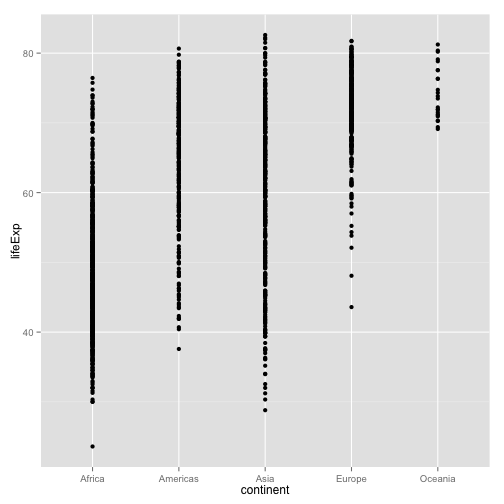
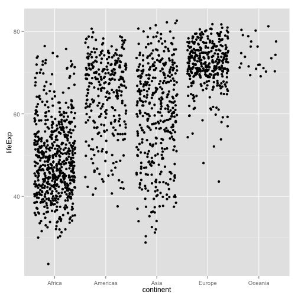
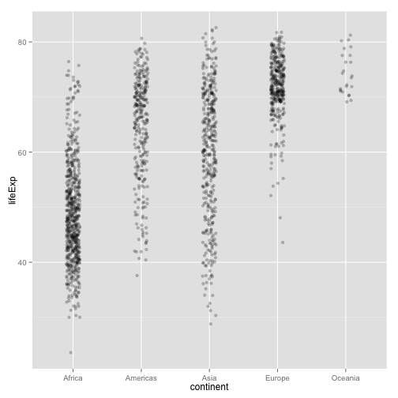
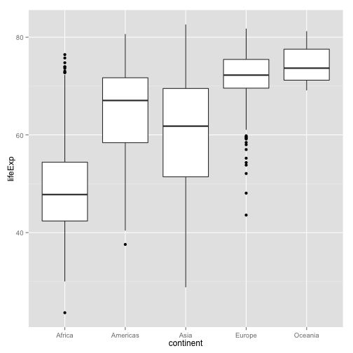
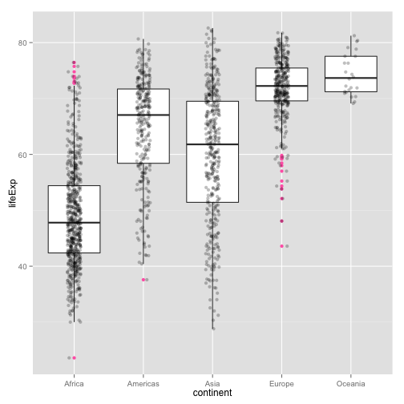
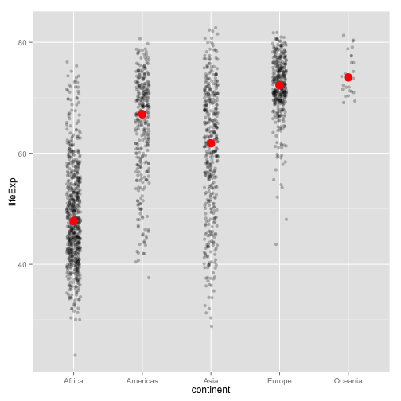
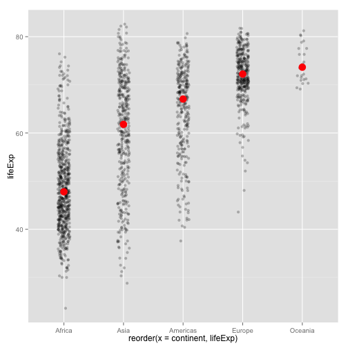

Note: this HTML is made by applying `knitr::spin()` to an R script. So the
narrative is very minimal.


```r
library(ggplot2)
```

pick a way to load the data


```r
gdURL <- "http://tiny.cc/gapminder"
gDat <- read.delim(file = gdURL) 
gDat <- read.delim("gapminderDataFiveYear.tsv")
str(gDat)
```

```
## 'data.frame':	1704 obs. of  6 variables:
##  $ country  : Factor w/ 142 levels "Afghanistan",..: 1 1 1 1 1 1 1 1 1 1 ...
##  $ year     : int  1952 1957 1962 1967 1972 1977 1982 1987 1992 1997 ...
##  $ pop      : num  8425333 9240934 10267083 11537966 13079460 ...
##  $ continent: Factor w/ 5 levels "Africa","Americas",..: 3 3 3 3 3 3 3 3 3 3 ...
##  $ lifeExp  : num  28.8 30.3 32 34 36.1 ...
##  $ gdpPercap: num  779 821 853 836 740 ...
```

stripplots: univariate scatterplots (but w/ ways to also convey 1+ factors)


```r
ggplot(gDat, aes(x = continent, y = lifeExp)) + geom_point()
```

 

we have an overplotting problem; need to spread things out


```r
ggplot(gDat, aes(x = continent, y = lifeExp)) + geom_jitter()
```

 

we can have less jitter in x, no jitter in y, more alpha transparency


```r
ggplot(gDat, aes(x = continent, y = lifeExp)) + 
  geom_jitter(position = position_jitter(width = 0.1, height = 0), alpha = 1/4)
```

 

boxplots -- covered properly elsewhere


```r
ggplot(gDat, aes(x = continent, y = lifeExp)) + geom_boxplot()
```

 

raw data AND boxplots


```r
ggplot(gDat, aes(x = continent, y = lifeExp)) +
  geom_boxplot(outlier.colour = "hotpink") +
  geom_jitter(position = position_jitter(width = 0.1, height = 0), alpha = 1/4)
```

 

superpose a statistical summary


```r
ggplot(gDat, aes(x = continent, y = lifeExp)) + 
  geom_jitter(position = position_jitter(width = 0.1), alpha = 1/4) +
  stat_summary(fun.y = median, colour = "red", geom = "point", size = 5)
```

 

let's reorder the continent factor based on lifeExp


```r
ggplot(gDat, aes(reorder(x = continent, lifeExp), y = lifeExp)) + 
  geom_jitter(position = position_jitter(width = 0.1), alpha = 1/4) +
  stat_summary(fun.y = median, colour = "red", geom = "point", size = 5)
```

 

```r
sessionInfo()
```

```
## R version 3.1.0 (2014-04-10)
## Platform: x86_64-apple-darwin10.8.0 (64-bit)
## 
## locale:
## [1] en_CA.UTF-8/en_CA.UTF-8/en_CA.UTF-8/C/en_CA.UTF-8/en_CA.UTF-8
## 
## attached base packages:
## [1] stats     graphics  grDevices utils     datasets  methods   base     
## 
## other attached packages:
## [1] mgcv_1.7-29     nlme_3.1-117    ggplot2_0.9.3.1 knitr_1.5.33   
## 
## loaded via a namespace (and not attached):
##  [1] colorspace_1.2-4 digest_0.6.4     evaluate_0.5.5   formatR_0.10    
##  [5] grid_3.1.0       gtable_0.1.2     labeling_0.2     lattice_0.20-29 
##  [9] markdown_0.6.5   MASS_7.3-33      Matrix_1.1-3     munsell_0.4.2   
## [13] plyr_1.8.1       proto_0.3-10     Rcpp_0.11.1      reshape2_1.4    
## [17] scales_0.2.4     stringr_0.6.2    tools_3.1.0
```

