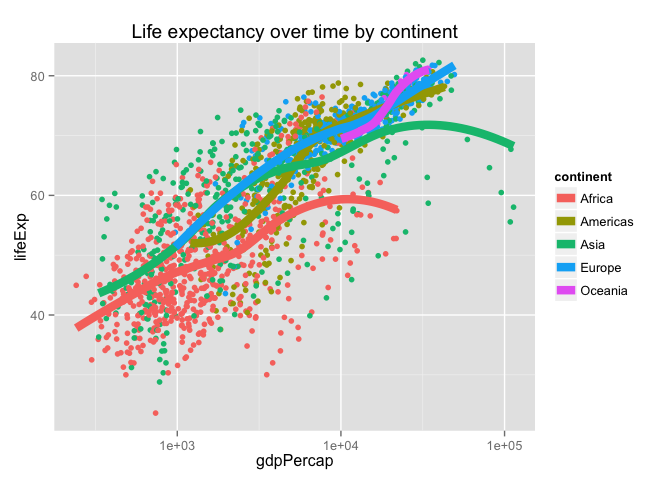
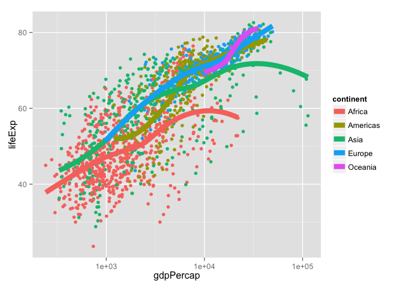
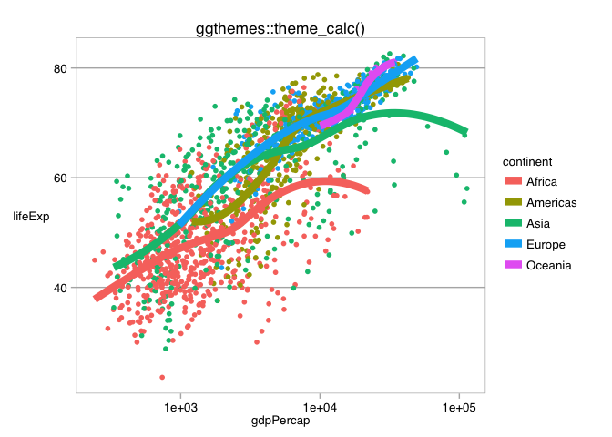
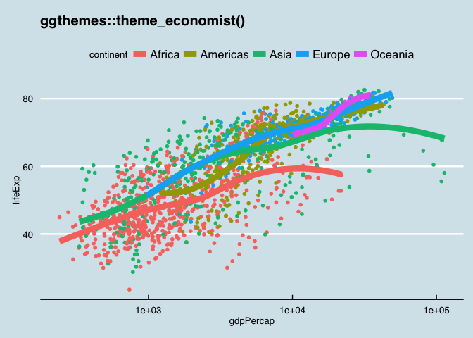
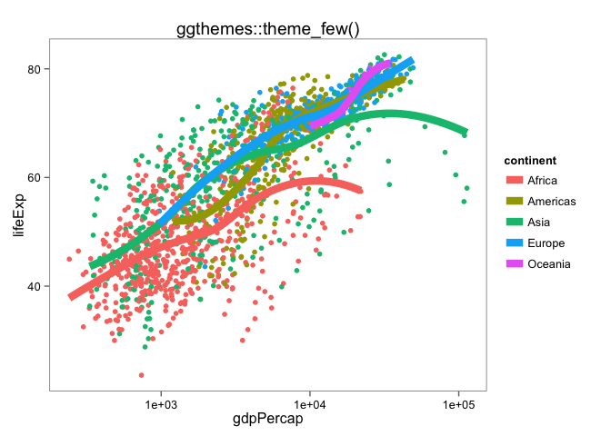
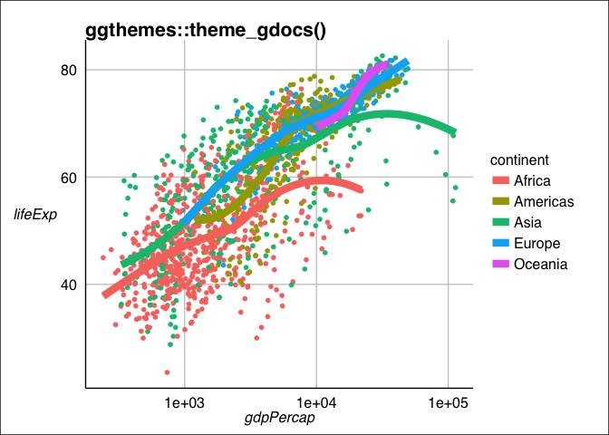
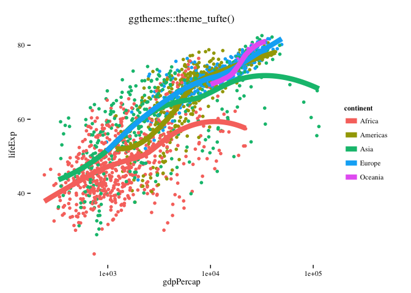
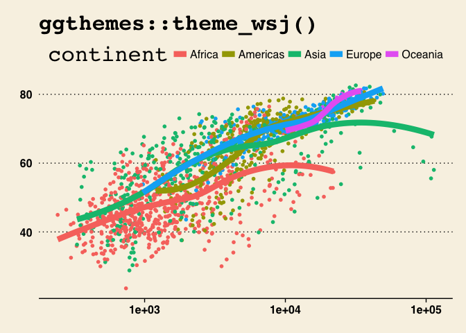

Jenny Bryan  


Note: this HTML is made by applying `knitr::spin()` to an R script. So the
narrative is very minimal.


```r
library(ggplot2)
library(ggthemes)
```

pick a way to load the data


```r
#gdURL <- "http://tiny.cc/gapminder"
#gapminder <- read.delim(file = gdURL) 
#gapminder <- read.delim("gapminderDataFiveYear.tsv")
library(gapminder)
str(gapminder)
```

```
## 'data.frame':	1704 obs. of  6 variables:
##  $ country  : Factor w/ 142 levels "Afghanistan",..: 1 1 1 1 1 1 1 1 1 1 ...
##  $ continent: Factor w/ 5 levels "Africa","Americas",..: 3 3 3 3 3 3 3 3 3 3 ...
##  $ year     : num  1952 1957 1962 1967 1972 ...
##  $ lifeExp  : num  28.8 30.3 32 34 36.1 ...
##  $ pop      : num  8425333 9240934 10267083 11537966 13079460 ...
##  $ gdpPercap: num  779 821 853 836 740 ...
```

revisit a plot from earlier


```r
p <- ggplot(gapminder, aes(x = gdpPercap, y = lifeExp))
p <- p + scale_x_log10()
p <- p + aes(color = continent) + geom_point() + geom_smooth(lwd = 3, se = FALSE)
p
```

 

give it a title


```r
p + ggtitle("Life expectancy over time by continent")
```

 

change overall look and feel with a premade theme


```r
p + theme_grey() # the default
```

 

suppress the usual grey background


```r
p + theme_bw()
```

 

exploring some themes from the ggthemes package  
https://github.com/jrnold/ggthemes


```r
p + theme_calc() + ggtitle("ggthemes::theme_calc()")
```

 

```r
p + theme_economist() + ggtitle("ggthemes::theme_economist()")
```

 

```r
p + theme_economist_white() + ggtitle("ggthemes::theme_economist_white()")
```

 

```r
p + theme_few() + ggtitle("ggthemes::theme_few()")
```

 

```r
p + theme_gdocs() + ggtitle("ggthemes::theme_gdocs()")
```

 

```r
p + theme_tufte() + ggtitle("ggthemes::theme_tufte()")
```

 

```r
p + theme_wsj() + ggtitle("ggthemes::theme_wsj()")
```

 

```r
sessionInfo()
```

```
## R version 3.1.2 (2014-10-31)
## Platform: x86_64-apple-darwin10.8.0 (64-bit)
## 
## locale:
## [1] en_CA.UTF-8/en_CA.UTF-8/en_CA.UTF-8/C/en_CA.UTF-8/en_CA.UTF-8
## 
## attached base packages:
## [1] stats     graphics  grDevices utils     datasets  methods   base     
## 
## other attached packages:
## [1] gapminder_0.1.0 ggthemes_1.7.0  ggplot2_1.0.0   knitr_1.10.5   
## 
## loaded via a namespace (and not attached):
##  [1] colorspace_1.2-4  digest_0.6.8      evaluate_0.7     
##  [4] formatR_1.2       grid_3.1.2        gtable_0.1.2     
##  [7] htmltools_0.2.6   labeling_0.3      magrittr_1.5     
## [10] MASS_7.3-35       munsell_0.4.2     plyr_1.8.2       
## [13] proto_0.3-10      Rcpp_0.11.6       reshape2_1.4.0.99
## [16] rmarkdown_0.5.1   scales_0.2.4      stringi_0.4-1    
## [19] stringr_1.0.0     tools_3.1.2       yaml_2.1.13
```


---
title: "gapminder-ggplot2-themes.r"
author: "jenny"
date: "Thu May 14 12:56:09 2015"
---
