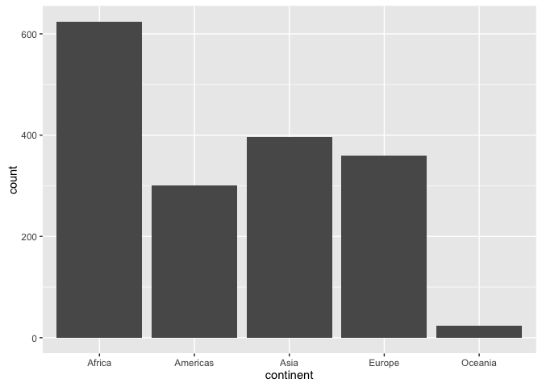
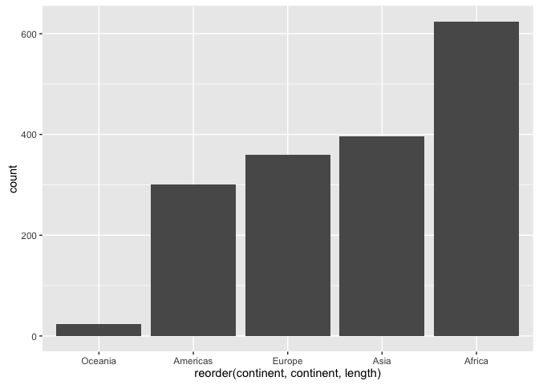
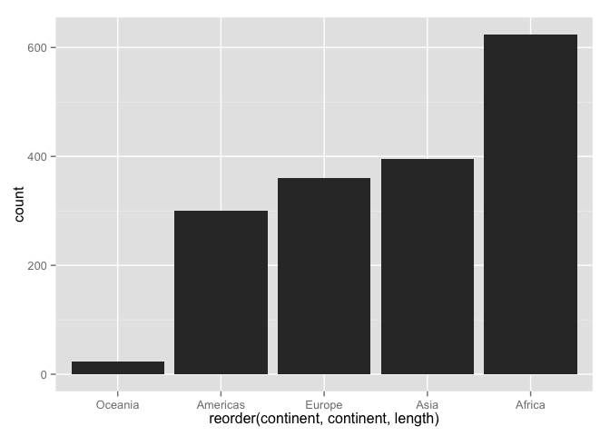
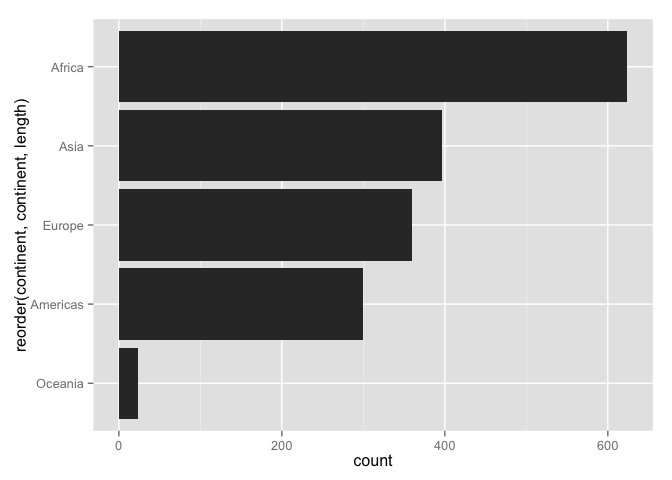
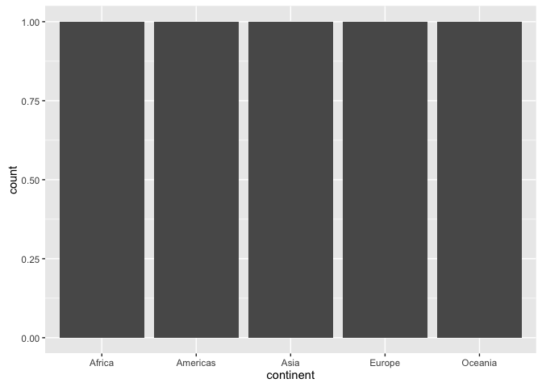
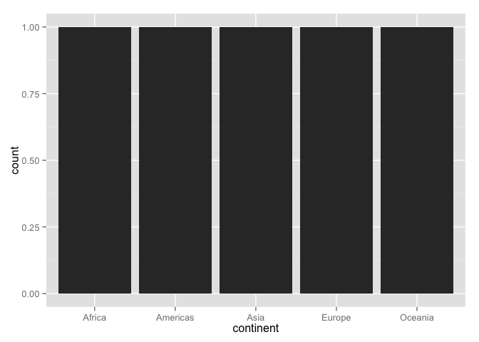

gapminder-ggplot2-univariate-factor.r
================
Jenny Bryan
Mon Oct 3 23:10:40 2016

Note: this is rendered by applying `knitr::spin()` to an R script. So the narrative is very minimal. load the data and ggplot2 (part of the tidyverse)

``` r
library(tidyverse)
```

    ## Loading tidyverse: ggplot2
    ## Loading tidyverse: tibble
    ## Loading tidyverse: tidyr
    ## Loading tidyverse: readr
    ## Loading tidyverse: purrr
    ## Loading tidyverse: dplyr

    ## Conflicts with tidy packages ----------------------------------------------

    ## filter(): dplyr, stats
    ## lag():    dplyr, stats

``` r
library(gapminder)
gapminder
```

    ## # A tibble: 1,704 × 6
    ##        country continent  year lifeExp      pop gdpPercap
    ##         <fctr>    <fctr> <int>   <dbl>    <int>     <dbl>
    ## 1  Afghanistan      Asia  1952  28.801  8425333  779.4453
    ## 2  Afghanistan      Asia  1957  30.332  9240934  820.8530
    ## 3  Afghanistan      Asia  1962  31.997 10267083  853.1007
    ## 4  Afghanistan      Asia  1967  34.020 11537966  836.1971
    ## 5  Afghanistan      Asia  1972  36.088 13079460  739.9811
    ## 6  Afghanistan      Asia  1977  38.438 14880372  786.1134
    ## 7  Afghanistan      Asia  1982  39.854 12881816  978.0114
    ## 8  Afghanistan      Asia  1987  40.822 13867957  852.3959
    ## 9  Afghanistan      Asia  1992  41.674 16317921  649.3414
    ## 10 Afghanistan      Asia  1997  41.763 22227415  635.3414
    ## # ... with 1,694 more rows

bar charts
consider: no. of observations for each continent

``` r
table(gapminder$continent)
```

    ## 
    ##   Africa Americas     Asia   Europe  Oceania 
    ##      624      300      396      360       24

this works because default stat for geom\_bar() is "bin"

``` r
ggplot(gapminder, aes(x = continent)) + geom_bar()
```



let's reorder the continents based on frequency

``` r
p <- ggplot(gapminder, aes(x = reorder(continent, continent, length)))
p + geom_bar()
```



would you rather the bars run horizontally?

``` r
p + geom_bar() + coord_flip()
```



how about a better <data:ink> ratio?

``` r
p + geom_bar(width = 0.05) + coord_flip()
```



consider a scenario where you DON'T want the default "bin" stat, i.e. the bar length or height already exists as a variable

``` r
(continent_freq <- gapminder %>% count(continent))
```

    ## # A tibble: 5 × 2
    ##   continent     n
    ##      <fctr> <int>
    ## 1    Africa   624
    ## 2  Americas   300
    ## 3      Asia   396
    ## 4    Europe   360
    ## 5   Oceania    24

this simple call no longer works, because we have pre-tabulated

``` r
ggplot(continent_freq, aes(x = continent)) + geom_bar()
```



THIS works when bar length or height already exists

``` r
ggplot(continent_freq, aes(x = continent, y = n)) + geom_bar(stat = "identity")
```



``` r
sessionInfo()
```

    ## R version 3.3.1 (2016-06-21)
    ## Platform: x86_64-apple-darwin13.4.0 (64-bit)
    ## Running under: OS X 10.11.6 (El Capitan)
    ## 
    ## locale:
    ## [1] en_CA.UTF-8/en_CA.UTF-8/en_CA.UTF-8/C/en_CA.UTF-8/en_CA.UTF-8
    ## 
    ## attached base packages:
    ## [1] stats     graphics  grDevices utils     datasets  methods   base     
    ## 
    ## other attached packages:
    ## [1] gapminder_0.2.0  dplyr_0.5.0      purrr_0.2.2      readr_1.0.0.9000
    ## [5] tidyr_0.6.0.9000 tibble_1.2       ggplot2_2.1.0    tidyverse_1.0.0 
    ## [9] knitr_1.14.2    
    ## 
    ## loaded via a namespace (and not attached):
    ##  [1] Rcpp_0.12.7        magrittr_1.5       munsell_0.4.3     
    ##  [4] colorspace_1.2-6   R6_2.1.3           stringr_1.1.0     
    ##  [7] plyr_1.8.4         tools_3.3.1        grid_3.3.1        
    ## [10] gtable_0.2.0       DBI_0.4-1          htmltools_0.3.5   
    ## [13] lazyeval_0.2.0     yaml_2.1.13        assertthat_0.1    
    ## [16] digest_0.6.10      formatR_1.4        evaluate_0.9      
    ## [19] rmarkdown_1.0.9014 labeling_0.3       stringi_1.1.1     
    ## [22] scales_0.4.0
