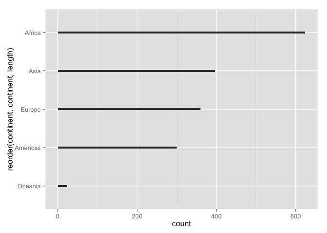
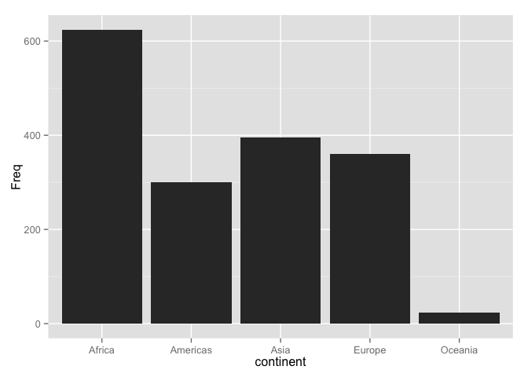

Jenny Bryan  


Note: this HTML is made by applying `knitr::spin()` to an R script. So the
narrative is very minimal.


```r
library(ggplot2)
```

pick a way to load the data


```r
#gdURL <- "http://tiny.cc/gapminder"
#gapminder <- read.delim(file = gdURL) 
#gapminder <- read.delim("gapminderDataFiveYear.tsv")
library(gapminder)
str(gapminder)
```

```
## 'data.frame':	1704 obs. of  6 variables:
##  $ country  : Factor w/ 142 levels "Afghanistan",..: 1 1 1 1 1 1 1 1 1 1 ...
##  $ continent: Factor w/ 5 levels "Africa","Americas",..: 3 3 3 3 3 3 3 3 3 3 ...
##  $ year     : num  1952 1957 1962 1967 1972 ...
##  $ lifeExp  : num  28.8 30.3 32 34 36.1 ...
##  $ pop      : num  8425333 9240934 10267083 11537966 13079460 ...
##  $ gdpPercap: num  779 821 853 836 740 ...
```

bar charts  
consider: no. of observations for each continent


```r
table(gapminder$continent)
```

```
## 
##   Africa Americas     Asia   Europe  Oceania 
##      624      300      396      360       24
```

this works because default stat for geom_bar() is "bin"


```r
ggplot(gapminder, aes(x = continent)) + geom_bar()
```

 

let's reorder the continents based on frequency


```r
p <- ggplot(gapminder, aes(x = reorder(continent, continent, length)))
p + geom_bar()
```

 

would you rather the bars run horizontally?


```r
p + geom_bar() + coord_flip()
```

 

how about a better data:ink ratio?


```r
p + geom_bar(width = 0.05) + coord_flip()
```

 

consider a scenario where you DON'T want the default "bin" stat, i.e. the bar
length or height already exists as a variable


```r
(jDat <- as.data.frame(with(gapminder, table(continent, deparse.level = 2))))
```

```
##   continent Freq
## 1    Africa  624
## 2  Americas  300
## 3      Asia  396
## 4    Europe  360
## 5   Oceania   24
```

this simple call no longer works, because we have pre-tabulated


```r
ggplot(jDat, aes(x = continent)) + geom_bar()
```

 

THIS works when bar length or height already exists


```r
ggplot(jDat, aes(x = continent, y = Freq)) + geom_bar(stat = "identity")
```

 

```r
sessionInfo()
```

```
## R version 3.1.2 (2014-10-31)
## Platform: x86_64-apple-darwin10.8.0 (64-bit)
## 
## locale:
## [1] en_CA.UTF-8/en_CA.UTF-8/en_CA.UTF-8/C/en_CA.UTF-8/en_CA.UTF-8
## 
## attached base packages:
## [1] stats     graphics  grDevices utils     datasets  methods   base     
## 
## other attached packages:
## [1] gapminder_0.1.0 ggplot2_1.0.0   knitr_1.10.5   
## 
## loaded via a namespace (and not attached):
##  [1] colorspace_1.2-4  digest_0.6.8      evaluate_0.7     
##  [4] formatR_1.2       grid_3.1.2        gtable_0.1.2     
##  [7] htmltools_0.2.6   labeling_0.3      magrittr_1.5     
## [10] MASS_7.3-35       munsell_0.4.2     plyr_1.8.2       
## [13] proto_0.3-10      Rcpp_0.11.6       reshape2_1.4.0.99
## [16] rmarkdown_0.5.1   scales_0.2.4      stringi_0.4-1    
## [19] stringr_1.0.0     tools_3.1.2       yaml_2.1.13
```


---
title: "gapminder-ggplot2-univariate-factor.r"
author: "jenny"
date: "Thu May 14 12:54:59 2015"
---
