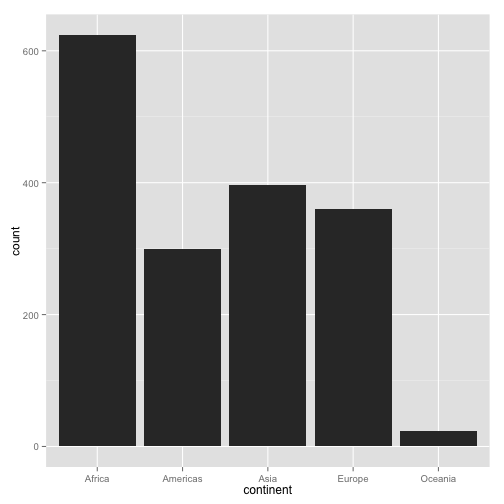
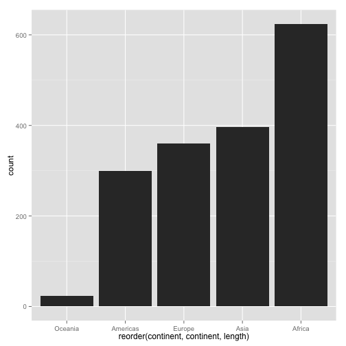
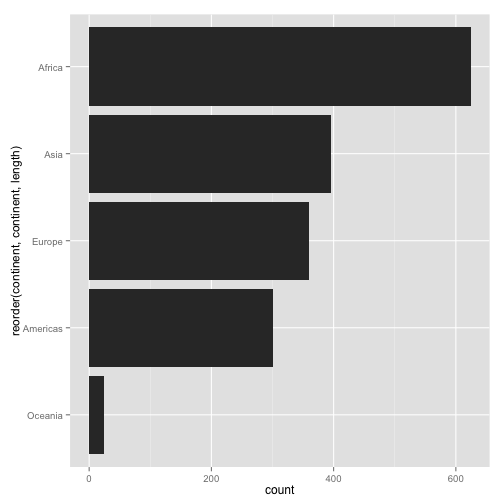
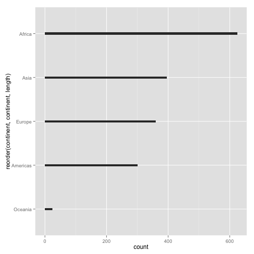
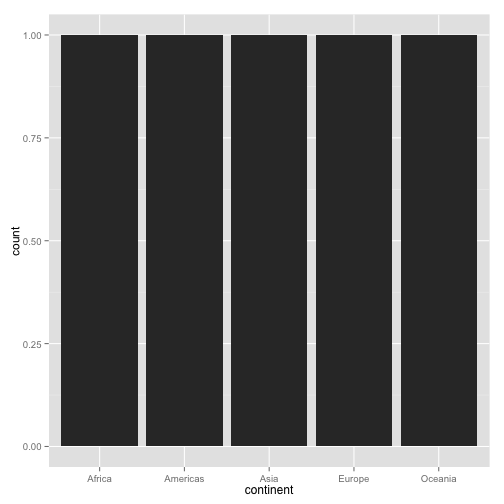

Note: this HTML is made by applying `knitr::spin()` to an R script. So the
narrative is very minimal.


```r
library(ggplot2)
```

pick a way to load the data


```r
gdURL <- "http://tiny.cc/gapminder"
gDat <- read.delim(file = gdURL) 
gDat <- read.delim("gapminderDataFiveYear.tsv")
str(gDat)
```

```
## 'data.frame':	1704 obs. of  6 variables:
##  $ country  : Factor w/ 142 levels "Afghanistan",..: 1 1 1 1 1 1 1 1 1 1 ...
##  $ year     : int  1952 1957 1962 1967 1972 1977 1982 1987 1992 1997 ...
##  $ pop      : num  8425333 9240934 10267083 11537966 13079460 ...
##  $ continent: Factor w/ 5 levels "Africa","Americas",..: 3 3 3 3 3 3 3 3 3 3 ...
##  $ lifeExp  : num  28.8 30.3 32 34 36.1 ...
##  $ gdpPercap: num  779 821 853 836 740 ...
```

bar charts  
consider: no. of observations for each continent


```r
table(gDat$continent)
```

```
## 
##   Africa Americas     Asia   Europe  Oceania 
##      624      300      396      360       24
```

this works because default stat for geom_bar() is "bin"


```r
ggplot(gDat, aes(x = continent)) + geom_bar()
```

 

let's reorder the continents based on frequency


```r
p <- ggplot(gDat, aes(x = reorder(continent, continent, length)))
p + geom_bar()
```

 

would you rather the bars run horizontally?


```r
p + geom_bar() + coord_flip()
```

 

how about a better data:ink ratio?


```r
p + geom_bar(width = 0.05) + coord_flip()
```

 

consider a scenario where you DON'T want the default "bin" stat, i.e. the bar
length or height already exists as a variable


```r
(jDat <- as.data.frame(with(gDat, table(continent, deparse.level = 2))))
```

```
##   continent Freq
## 1    Africa  624
## 2  Americas  300
## 3      Asia  396
## 4    Europe  360
## 5   Oceania   24
```

this simple call no longer works, because we have pre-tabulated


```r
ggplot(jDat, aes(x = continent)) + geom_bar()
```

 

THIS works when bar length or height already exists


```r
ggplot(jDat, aes(x = continent, y = Freq)) + geom_bar(stat = "identity")
```

 

```r
sessionInfo()
```

```
## R version 3.1.0 (2014-04-10)
## Platform: x86_64-apple-darwin10.8.0 (64-bit)
## 
## locale:
## [1] en_CA.UTF-8/en_CA.UTF-8/en_CA.UTF-8/C/en_CA.UTF-8/en_CA.UTF-8
## 
## attached base packages:
## [1] stats     graphics  grDevices utils     datasets  methods   base     
## 
## other attached packages:
## [1] ggplot2_0.9.3.1 knitr_1.5.33   
## 
## loaded via a namespace (and not attached):
##  [1] colorspace_1.2-4 digest_0.6.4     evaluate_0.5.5   formatR_0.10    
##  [5] grid_3.1.0       gtable_0.1.2     labeling_0.2     MASS_7.3-33     
##  [9] munsell_0.4.2    plyr_1.8.1       proto_0.3-10     Rcpp_0.11.1     
## [13] reshape2_1.4     scales_0.2.4     stringr_0.6.2    tools_3.1.0
```

