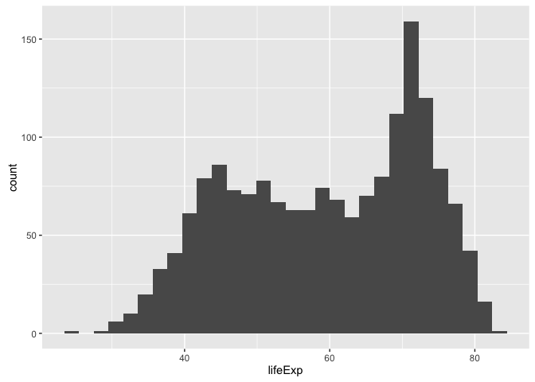
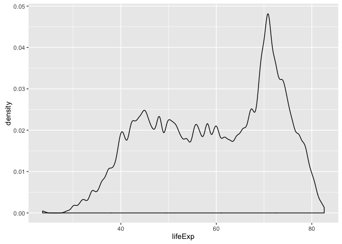
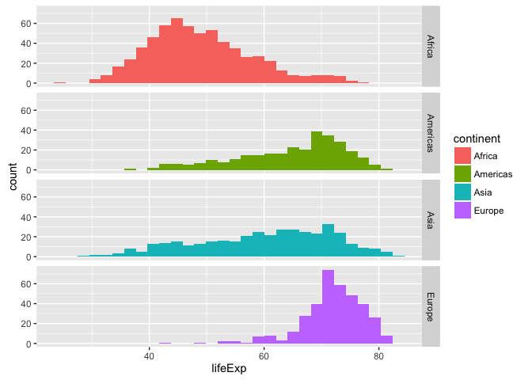
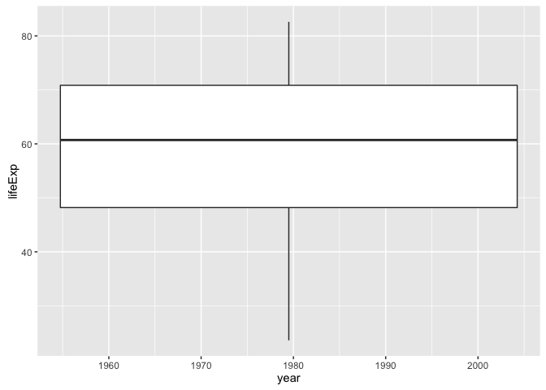
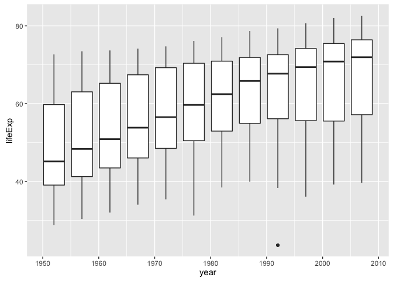
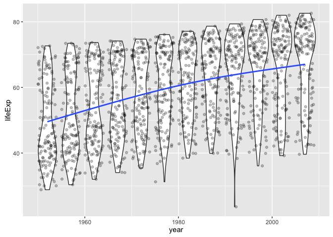

gapminder-ggplot2-univariate-quantitative.r
================
Jenny Bryan
Mon Oct 3 23:49:33 2016

Note: this is rendered by applying `knitr::spin()` to an R script. So the narrative is very minimal. load the data and ggplot2 (part of the tidyverse)

``` r
library(tidyverse)
```

    ## Loading tidyverse: ggplot2
    ## Loading tidyverse: tibble
    ## Loading tidyverse: tidyr
    ## Loading tidyverse: readr
    ## Loading tidyverse: purrr
    ## Loading tidyverse: dplyr

    ## Conflicts with tidy packages ----------------------------------------------

    ## filter(): dplyr, stats
    ## lag():    dplyr, stats

``` r
library(gapminder)
gapminder
```

    ## # A tibble: 1,704 × 6
    ##        country continent  year lifeExp      pop gdpPercap
    ##         <fctr>    <fctr> <int>   <dbl>    <int>     <dbl>
    ## 1  Afghanistan      Asia  1952  28.801  8425333  779.4453
    ## 2  Afghanistan      Asia  1957  30.332  9240934  820.8530
    ## 3  Afghanistan      Asia  1962  31.997 10267083  853.1007
    ## 4  Afghanistan      Asia  1967  34.020 11537966  836.1971
    ## 5  Afghanistan      Asia  1972  36.088 13079460  739.9811
    ## 6  Afghanistan      Asia  1977  38.438 14880372  786.1134
    ## 7  Afghanistan      Asia  1982  39.854 12881816  978.0114
    ## 8  Afghanistan      Asia  1987  40.822 13867957  852.3959
    ## 9  Afghanistan      Asia  1992  41.674 16317921  649.3414
    ## 10 Afghanistan      Asia  1997  41.763 22227415  635.3414
    ## # ... with 1,694 more rows

distribution of a quant var: histogram

``` r
ggplot(gapminder, aes(x = lifeExp)) +
  geom_histogram()
```

    ## `stat_bin()` using `bins = 30`. Pick better value with `binwidth`.



experiment with bin width; think in terms of the units of the x variable

``` r
ggplot(gapminder, aes(x = lifeExp)) +
  geom_histogram(binwidth = 1)
```


show the different continents, but it's weird to stack up the histograms, which is what default of `position = "stack"` delivers

``` r
ggplot(gapminder, aes(x = lifeExp, fill = continent)) +
  geom_histogram()
```

    ## `stat_bin()` using `bins = 30`. Pick better value with `binwidth`.


`position = "identity"` is good to know about it's still weird to layer them on top of each other like this

``` r
ggplot(gapminder, aes(x = lifeExp, fill = continent)) +
  geom_histogram(position = "identity")
```

    ## `stat_bin()` using `bins = 30`. Pick better value with `binwidth`.


geom\_freqpoly() is better in this case

``` r
ggplot(gapminder, aes(x = lifeExp, color = continent)) +
  geom_freqpoly()
```

    ## `stat_bin()` using `bins = 30`. Pick better value with `binwidth`.


smooth histogram = densityplot

``` r
ggplot(gapminder, aes(x = lifeExp)) + geom_density()
```


you should look at different levels of smoothing

``` r
ggplot(gapminder, aes(x = lifeExp)) + geom_density(adjust = 1)
```


``` r
ggplot(gapminder, aes(x = lifeExp)) + geom_density(adjust = 0.2)
```



densityplots work better in terms of one continent not obscuring another

``` r
ggplot(gapminder, aes(x = lifeExp, color = continent)) + geom_density()
```


alpha transparency works here too

``` r
ggplot(gapminder, aes(x = lifeExp, fill = continent)) +
  geom_density(alpha = 0.2)
```


with only two countries, maybe we should ignore Oceania?

``` r
ggplot(subset(gapminder, continent != "Oceania"),
       aes(x = lifeExp, fill = continent)) + geom_density(alpha = 0.2)
```


facets work here too

``` r
ggplot(gapminder, aes(x = lifeExp)) + geom_density() + facet_wrap(~ continent)
```


``` r
ggplot(subset(gapminder, continent != "Oceania"),
       aes(x = lifeExp, fill = continent)) + geom_histogram() +
  facet_grid(continent ~ .)
```

    ## `stat_bin()` using `bins = 30`. Pick better value with `binwidth`.



boxplot for one quantitative variable against a discrete variable
first attempt does not work since year is not formally a factor

``` r
ggplot(gapminder, aes(x = year, y = lifeExp)) + geom_boxplot()
```

    ## Warning: Continuous x aesthetic -- did you forget aes(group=...)?



by explicitly specifying year as the grouping variable, we get what we want

``` r
ggplot(gapminder, aes(x = year, y = lifeExp)) + geom_boxplot(aes(group = year))
```



try geom\_violin() instead and just generally goofing off now

``` r
ggplot(gapminder, aes(x = year, y = lifeExp)) +
  geom_violin(aes(group = year)) +
  geom_jitter(alpha = 1/4) +
  geom_smooth(se = FALSE)
```


