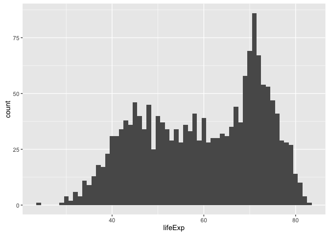
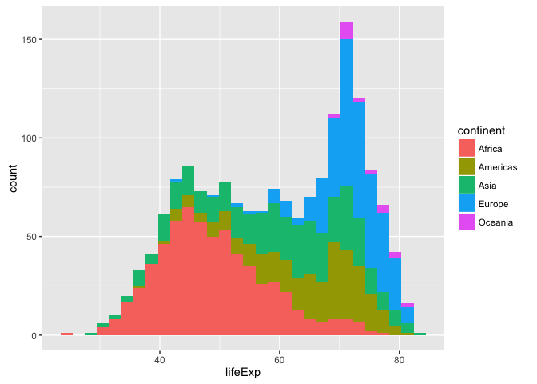
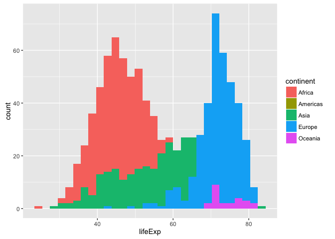
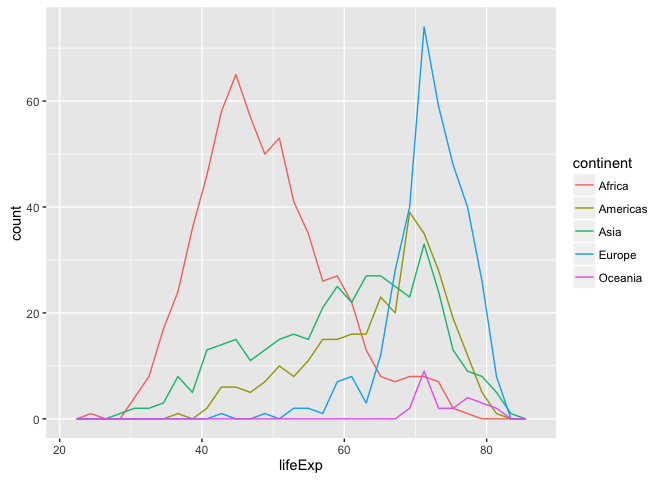
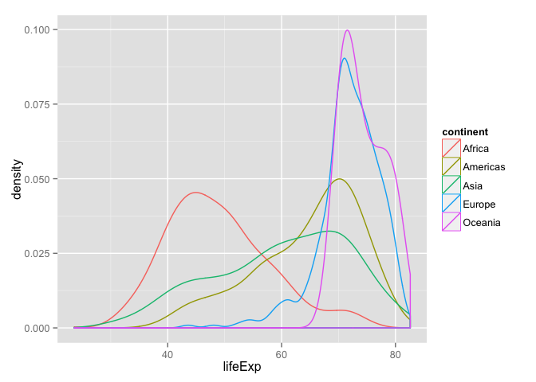
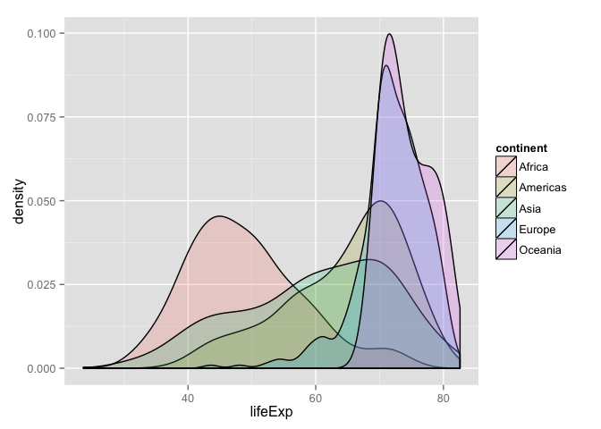
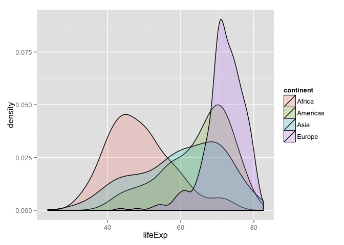
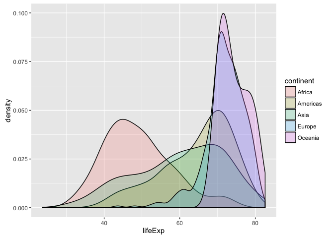
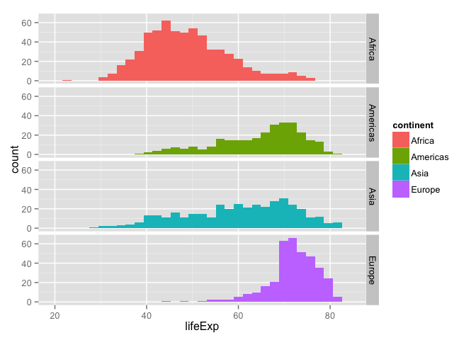
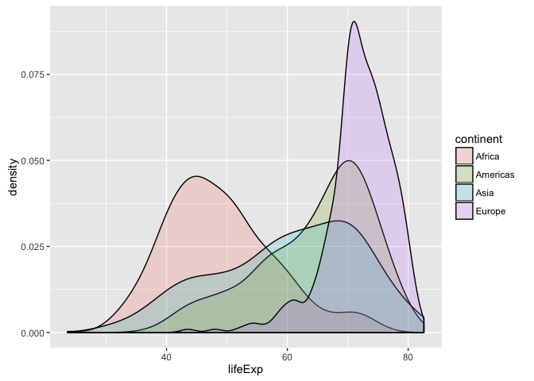

Jenny Bryan  


Note: this HTML is made by applying `knitr::spin()` to an R script. So the
narrative is very minimal.


```r
library(ggplot2)
```

pick a way to load the data


```r
#gdURL <- "http://tiny.cc/gapminder"
#gapminder <- read.delim(file = gdURL) 
#gapminder <- read.delim("gapminderDataFiveYear.tsv")
library(gapminder)
str(gapminder)
```

```
## 'data.frame':	1704 obs. of  6 variables:
##  $ country  : Factor w/ 142 levels "Afghanistan",..: 1 1 1 1 1 1 1 1 1 1 ...
##  $ continent: Factor w/ 5 levels "Africa","Americas",..: 3 3 3 3 3 3 3 3 3 3 ...
##  $ year     : num  1952 1957 1962 1967 1972 ...
##  $ lifeExp  : num  28.8 30.3 32 34 36.1 ...
##  $ pop      : num  8425333 9240934 10267083 11537966 13079460 ...
##  $ gdpPercap: num  779 821 853 836 740 ...
```

distribution of a quant var: histogram


```r
ggplot(gapminder, aes(x = lifeExp)) + geom_histogram()
```

 

smooth histogram = densityplot


```r
ggplot(gapminder, aes(x = lifeExp)) + geom_density()
```

 

show the different continents, but I think it's weird to stack up the
histograms, which is what default of `position = "stack"` delivers


```r
ggplot(gapminder, aes(x = lifeExp, fill = continent)) + geom_histogram()
```

 

`position = "identity"` is good to know about


```r
ggplot(gapminder, aes(x = lifeExp, fill = continent)) +
  geom_histogram(position = "identity")
```

 

densityplots work better in terms of one continent not obscuring another


```r
ggplot(gapminder, aes(x = lifeExp, color = continent)) + geom_density()
```

 

alpha transparency works here too


```r
ggplot(gapminder, aes(x = lifeExp, fill = continent)) +
  geom_density(alpha = 0.2)
```

 

with only two countries, maybe we should ignore Oceania?


```r
ggplot(subset(gapminder, continent != "Oceania"),
       aes(x = lifeExp, fill = continent)) + geom_density(alpha = 0.2)
```

 

facets work here too


```r
ggplot(gapminder, aes(x = lifeExp)) + geom_density() + facet_wrap(~ continent)
```

 

```r
ggplot(subset(gapminder, continent != "Oceania"),
       aes(x = lifeExp, fill = continent)) + geom_histogram() +
  facet_grid(continent ~ .)
```

 

boxplot for one quantitative variable against a discrete variable  
first attempt does not work since year is not formally a factor


```r
ggplot(gapminder, aes(x = year, y = lifeExp)) + geom_boxplot()
```

 

by explicitly specifying year as the grouping variable, we get what we want


```r
ggplot(gapminder, aes(x = year, y = lifeExp)) + geom_boxplot(aes(group = year))
```

 


---
title: "gapminder-ggplot2-univariate-quantitative.r"
author: "jenny"
date: "Thu May 14 12:52:33 2015"
---
